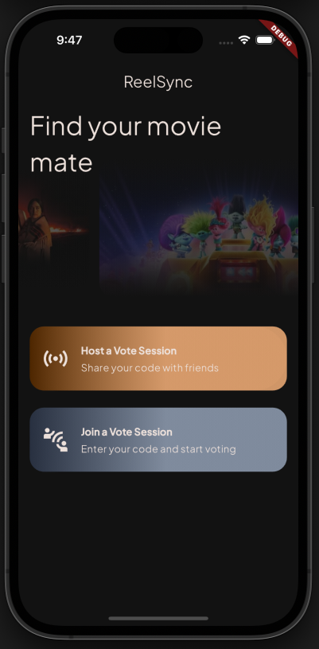
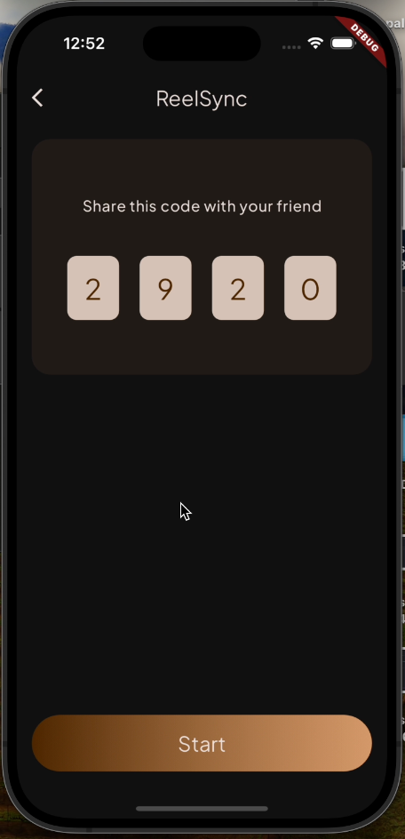
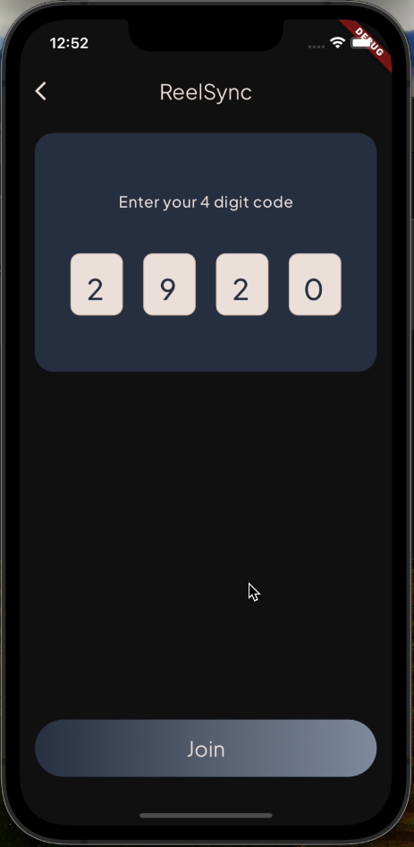
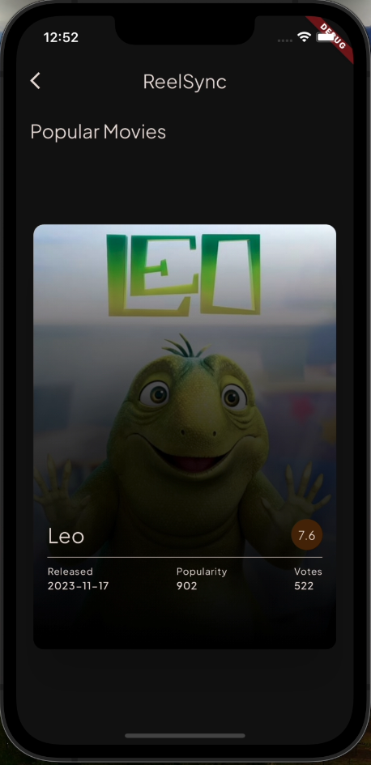
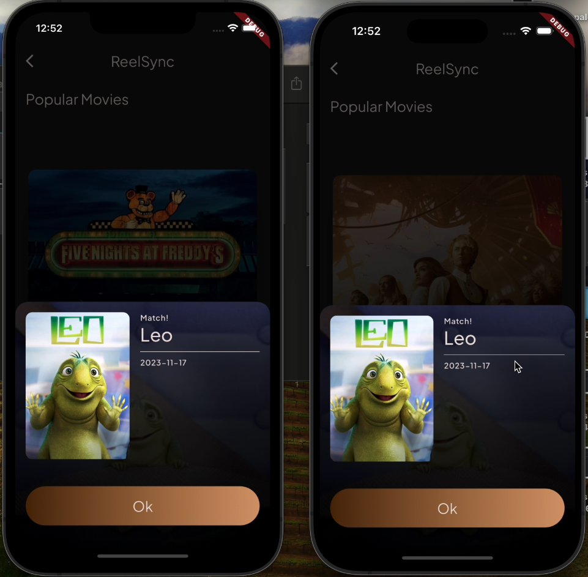

# ReelSync: Movie Night App

## Description
ReelSync is a mobile application designed for two people to collaboratively select a movie to watch together. The application uses The Movie DB API (TMDb), and streamlines the process of choosing a movie, ensuring a seamless movie night experience between friends.

## Screens

### Welcome Screen
- Users choose to start a session or join an existing one.
- Utilizes platform_device_id package to retrieve device ID.
- Options to get a code to share or enter a shared code.

### Share Code Screen
- Generates a code to share with another user.
- Makes an HTTP call to the MovieNight API's /start-session endpoint.
- Saves session ID for future reference.

### Enter Code Screen
- Allows users to enter a shared code.
- Makes an HTTP call to the MovieNight API's /join-session endpoint.
- Handles errors gracefully.

### Movie Selection Screen
- Fetches movies from The Movie DB API.
- Displays movie details and allows users to swipe left or right to indicate preferences.
- Makes HTTP calls to the MovieNight API's /vote-movie endpoint for each vote.
- Notifies users of matches with partner.
<table>
  <tr>
    <td></td>
    <td></td>
  </tr>
</table>

## Functionality

### Welcome Screen Requirements
- Utilizes device ID package to retrieve unique device ID.
- Allows users to start or join a session.

### Share Code Screen Requirements
- Generates a code to share with another user.
- Saves session ID for future reference.
- Navigates to Movie Selection Screen.

### Enter Code Screen Requirements
- Allows users to enter a shared code.
- Handles errors gracefully.
- Navigates to Movie Selection Screen upon successful code submission.

### Movie Selection Screen Requirements
- Fetches movies from The Movie DB API.
- Displays movie details and allows swiping to indicate preferences.
- Makes HTTP calls to MovieNight API for each vote.
- Notifies users of matches with partner.
- Handles loading of additional movies from TMDB API.

### HTTP and Data Requirements
- Implements an HttpHelper class for API calls.
- Saves device ID and session ID using SharedPreferences, ChangeNotifierProvider, or JSON file.

### Design Requirements
- Unique launcher icon and splash screen.
- Ensures text readability and accessibility.
- Consistent spacing using base number.
- Utilizes a single Google Font for text.
- Defines ColorScheme and TextTheme in MaterialApp theme property.
